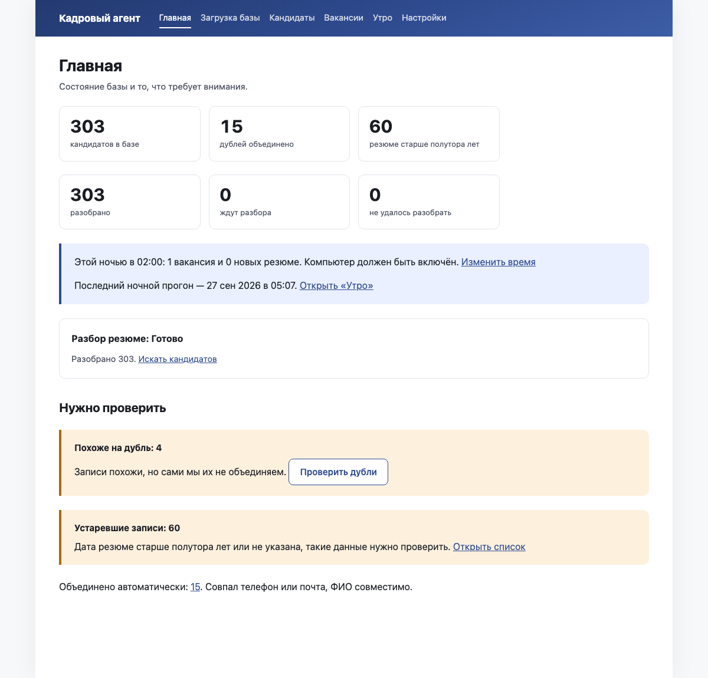

# Кадровый агент

Кадровый агент берёт вашу базу кандидатов из CRM, приводит её в порядок и под каждую вакансию выдаёт короткий список: кто подходит, почему, что настораживает и что спросить на первом созвоне. Каждый довод опирается на цитату из резюме. Решает рекрутер: агент сортирует и объясняет, но никого не скрывает и не отклоняет сам.

Приложение работает на вашем компьютере или сервере. Резюме хранятся у вас; в сервис ИИ уходит текст резюме без ФИО, телефонов, почты и ссылок.



## Установка

Нужен [uv](https://docs.astral.sh/uv/getting-started/installation/) — он сам поставит нужную версию Python. Дальше две команды:

```
uv sync
make demo
```

и откройте в браузере http://127.0.0.1:8000.

`make demo` собирает демонстрационную базу: 303 вымышленных кандидата пяти профессий, среди них дубли и устаревшие резюме, вакансию «Начальник литейного производства» с оценённым списком и отчёт за одну ночь. Ключ к сервису ИИ для демо не нужен: ответы модели записаны заранее. Первый запуск скачивает модель смыслового поиска (около 500 МБ) и занимает несколько минут, следующие — меньше минуты.

Для работы со своей базой запускайте приложение так:

```
uv run app
```

### Через Docker

```
docker compose up
```

Приложение откроется по тому же адресу, http://127.0.0.1:8000, и будет доступно только с этого компьютера. База и загруженные файлы лежат в папке `data/` рядом с `compose.yaml` и переживают перезапуск контейнера.

## Первый запуск

На «Главной» видно, сколько кандидатов в базе и сколько резюме разобрано, что ждёт вашего решения и когда пойдёт ночной прогон. Первым делом откройте «Настройки» и в блоке «Подключение к ИИ» вставьте ключ доступа, потом нажмите «Проверить подключение». Без ключа работает всё, кроме разбора резюме и оценки кандидатов.

## Загрузка своей базы


1. Выгрузите базу из CRM в CSV или XLSX. Файлы резюме (PDF, DOCX, TXT) можно положить отдельно, папкой или ZIP-архивом.
2. На экране «Загрузка базы» выберите файлы и нажмите «Загрузить и проверить колонки».
3. Агент покажет таблицу «Колонка в файле — Примеры — Что это». Проверьте, правильно ли он понял колонки, поправьте, если нужно, и нажмите «Начать разбор».
4. Когда файлы прочитаны, нажмите «Разобрать 20 для проверки»: агент разберёт двадцать резюме, и вы увидите, как он их понял. Если всё верно — «Начать разбор всей базы». До старта агент покажет, сколько это займёт и сколько будет стоить. Разбор идёт в фоне, вкладку можно закрыть.

Каждая загрузка получает имя вида «Загрузка 26 сен, 14:05 · crm_export.xlsx». История загрузок с итогами — внизу экрана «Загрузка базы», а на экране «Кандидаты» есть фильтр «Из загрузки…».

Точные дубли (тот же телефон или почта при совместимом ФИО) агент объединяет сам и показывает на «Главной» строкой «Объединено автоматически». Похожие записи он не трогает, а ставит в очередь «Похоже на дубль»: там две карточки рядом, совпавшие поля подсвечены, и три кнопки — «Объединить», «Нет, это разные люди», «Отложить». Любое объединение можно отменить кнопкой «Отменить объединение» на карточке кандидата.

## Первая вакансия


1. «Вакансии» → «Новая вакансия». Опишите её так, как рассказали бы коллеге, и нажмите «Разобрать описание».
2. Агент покажет «Портрет кандидата»: что обязательно, что желательно и чего точно не надо. Удалите лишнее, поправьте формулировки, допишите своё. Требования про возраст, пол и семейное положение агент пометит и в оценку не возьмёт.
3. Нажмите «Оценить 5 для проверки», посмотрите результат, потом «Оценить 40».
4. В «Результате по вакансии» кандидаты разложены по группам «Подходят», «Можно рассмотреть», «Скорее не подходят». У каждого — почему подходит, что настораживает, вопросы на созвон и ссылка «Показать в резюме». Если агент ошибся, нажмите «Неверно» у довода: он запомнит поправку. Список для клиента — «Скачать Excel», без телефонов и почты.

## Ночной режим


Каждую ночь в 02:00 агент помечает устаревшие резюме, ищет возможные дубли, готовит новые резюме к поиску по смыслу и оценивает новых кандидатов по вакансиям с отметкой «Оценивать каждую ночь». Утром отчёт ждёт на экране «Утро»: сколько новых кандидатов подходит по каждой вакансии, что нужно решить, что изменилось в базе и что не получилось.

Время и дни меняются в «Настройках», блок «Ночной прогон»: «Каждую ночь в 02:00» или «По будням в 02:00». Компьютер в это время должен быть включён. Если он спал и проснулся в течение шести часов, прогон пройдёт сразу при пробуждении, а «Утро» скажет, во сколько он начался. Если позже — «Утро» начнётся с причины и кнопки «Запустить сейчас».

Отчёт можно получать на почту: в «Настройках», блок «Почта для отчёта», укажите почтовый сервер, порт, логин, пароль и адрес получателя, затем нажмите «Отправить пробное письмо». В письме только числа и названия вакансий со ссылками — имён и контактов кандидатов в нём нет.

## Что уходит в модель, а что нет

Уходит: текст резюме, из которого убраны ФИО (во всех падежах, инициалами и латиницей), телефоны, почта, ссылки на соцсети и мессенджеры, дата рождения и номера документов. На их месте стоят метки вида [ИМЯ] и [ТЕЛЕФОН]. Пример того, как модель видит резюме, — в «Настройках», блок «Что уходит модели».

Не уходит: исходные файлы и их имена, контакты, ваши решения по кандидатам. Поиск по смыслу работает на этом компьютере, резюме для него никуда не отправляются.

## Где лежат данные

Всё в папке `data/` рядом с приложением: база `data/app.db`, загруженные файлы `data/uploads/`, модель смыслового поиска `data/models/`. Демо живёт отдельно, в `data/demo/`, и пересоздаётся при каждом `make demo`. Чтобы перенести приложение на другой компьютер, скопируйте папку `data/`.

## Как сменить сервис ИИ

«Настройки» → «Подключение к ИИ». В поле «Сервис» выберите «Claude (Anthropic или ClaudeHub)» или «Совместимый с OpenAI (например, YandexGPT)», укажите адрес сервиса, ключ доступа и две модели: для разбора резюме и для оценки под вакансию. Нажмите «Сохранить», затем «Проверить подключение». Цены сервиса там же: по ним агент заранее считает стоимость разбора и оценки.
