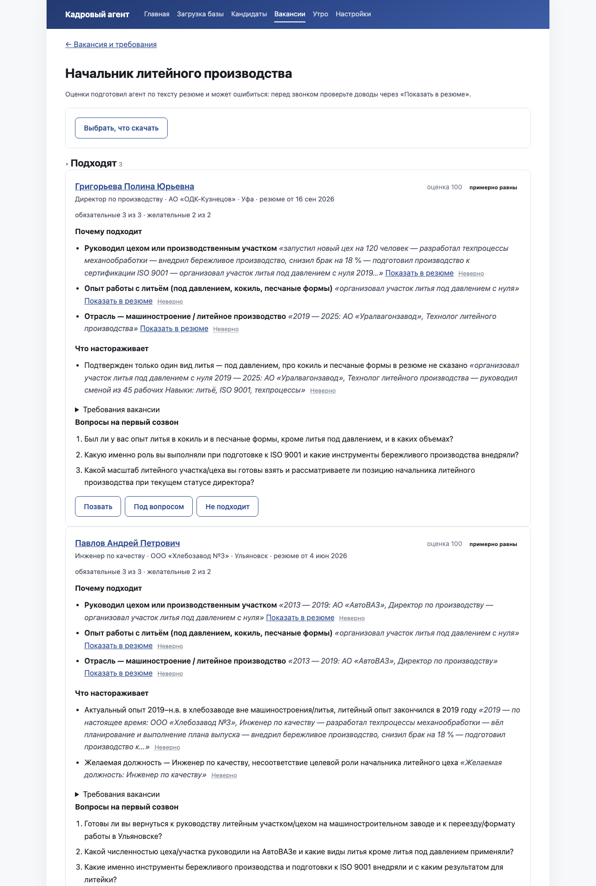
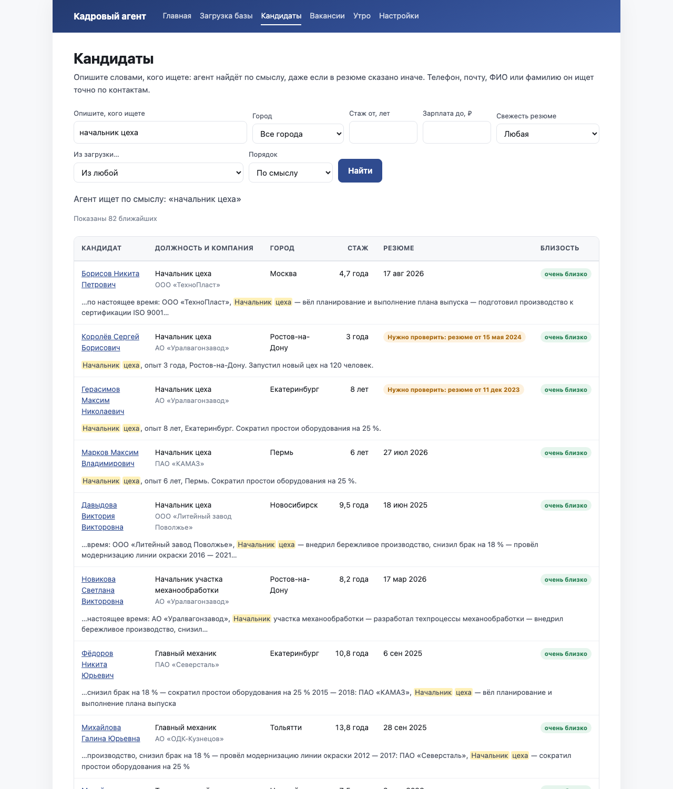
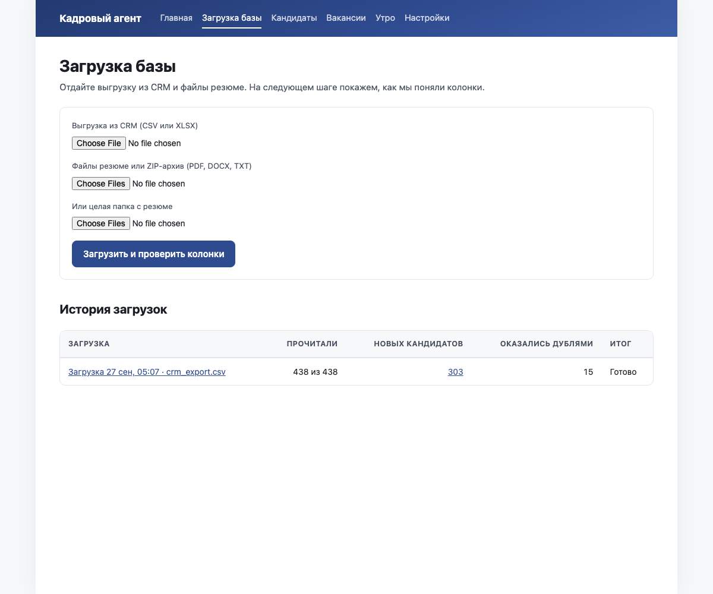
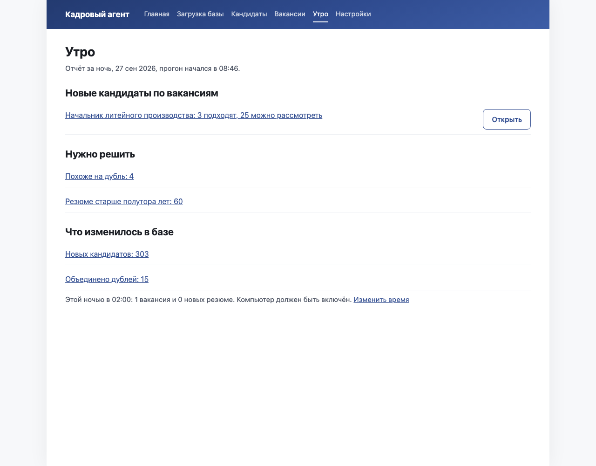

# Кадровый агент

*A local AI assistant for recruiters who work with their own resume database.*
*Resumes stay on your machine; the language model only sees anonymized text. The interface is in Russian.*

Кадровый агент берёт базу кандидатов, которую рекрутёр годами копил в CRM, приводит её в порядок и под каждую вакансию выдаёт короткий список: кто подходит, почему, что настораживает и что спросить на первом созвоне. Каждый довод опирается на цитату из резюме. База лежит на компьютере рекрутёра, а в языковую модель уходит только обезличенный текст: без ФИО, телефонов, почты и ссылок. Решает человек: агент сортирует и объясняет, но никого не скрывает и не отклоняет сам.



## Что умеет

- **Импорт.** Принимает выгрузку CRM в CSV или XLSX и отдельно файлы резюме (PDF, DOCX, TXT) папкой или ZIP-архивом. Сам угадывает, в какой колонке телефон, почта, ФИО или дата, и показывает догадку таблицей «Колонка в файле — Примеры — Что это», чтобы рекрутёр поправил её до загрузки.
- **Чистка и дубли.** Приводит телефоны, почту и ФИО к одному виду. Точные дубли (тот же телефон или почта при совместимом ФИО) объединяет сам, похожие ставит в очередь «Похоже на дубль» с двумя карточками рядом. Любое объединение отменяется одной кнопкой.
- **Разбор резюме.** Языковая модель превращает текст резюме в структуру: должности, компании, отрасли, навыки, стаж, город, зарплата, готовность к переезду. Каждое поле ведёт к своей строке в исходнике, а поле без опоры помечено «в резюме не сказано». Стаж считает код по датам, а не модель.
- **Поиск.** Запрос словами («руководитель производства, запуск цеха с нуля») ищет и по смыслу, и по точным терминам сразу. Жёсткие фильтры — город, стаж, зарплата, свежесть резюме. ФИО, телефон или почту агент ищет точным совпадением по контактам.
- **Вакансия.** Рекрутёр описывает вакансию так, как рассказал бы коллеге, а агент составляет «Портрет кандидата»: что обязательно, что желательно, чего точно не надо. Портрет правится до запуска. Требования про возраст, пол и семейное положение агент помечает и в оценку не берёт.
- **Оценка.** Кандидаты раскладываются по группам «Подходят», «Можно рассмотреть», «Скорее не подходят». У каждого — три довода «Почему подходит» и два «Что настораживает» с цитатами, статус по каждому требованию, три вопроса на созвон и ссылка «Показать в резюме». Кнопка «Неверно» у довода учит агента на будущее.
- **Excel.** Список скачивается в двух вариантах: «Для себя, с контактами» и «Для клиента, без телефона и почты».
- **Ночной прогон.** По расписанию («Каждую ночь в 02:00» или «По будням в 02:00») агент помечает устаревшие резюме, ищет возможные дубли, готовит новые резюме к поиску по смыслу и оценивает новых кандидатов по вакансиям с отметкой «Оценивать каждую ночь». Утром отчёт ждёт на экране «Утро».
- **Письмо с отчётом.** Отчёт можно получать на почту через свой SMTP-сервер. В письме только числа и названия вакансий со ссылками, без имён и контактов кандидатов.



## Попробовать за две минуты

Демо собирает вымышленную базу из 303 кандидатов пяти профессий (с дублями и устаревшими резюме), вакансию «Начальник литейного производства» с оценённым списком и отчёт за одну ночь. Ключ к языковой модели для демо не нужен: её ответы записаны заранее.

### Из исходников

Нужен [uv](https://docs.astral.sh/uv/getting-started/installation/) — менеджер пакетов Python, он сам поставит Python 3.12. Ещё нужен `make` (на Mac и Linux он обычно есть).

```bash
git clone https://github.com/vitaliykalachev/talent-agent.git
cd talent-agent
uv sync && make demo
```

Затем откройте http://127.0.0.1:8000. Первый запуск скачивает модель смыслового поиска (около 500 МБ) и занимает несколько минут, следующие — меньше минуты. Демо живёт в отдельной папке `data/demo/` и пересоздаётся при каждом `make demo`.

Для своей базы приложение запускается командой `uv run app` (или `make run`), данные лежат в `data/`.

### Через Docker

```bash
docker compose up
```

Адрес тот же, http://127.0.0.1:8000, и открыт он только с этого компьютера. База и загруженные файлы лежат в `data/` рядом с `compose.yaml` и переживают перезапуск контейнера. Контейнер стартует с пустой базой, без демо.

### Готовые сборки без установки

Портативные сборки со своим Python, моделью поиска и демо-базой выкладываются в [релизы](https://github.com/vitaliykalachev/talent-agent/releases).

- **Mac с Apple Silicon** — одна команда в «Терминале»:

  ```bash
  curl -fsSL https://github.com/vitaliykalachev/talent-agent/releases/latest/download/install-mac.sh | bash
  ```

- **Windows 10/11, 64 бит** — скачайте `kadrovyi-agent-win64.zip` из релизов, распакуйте целиком (лучше на рабочий стол) и дважды нажмите «Запустить.bat». Чёрное окно не закрывайте, пока работаете: в нём работает агент. Права администратора и интернет не нужны.

## Подключить ИИ

Для своей базы нужен ключ к языковой модели. Подходит один из трёх вариантов:

- Anthropic напрямую;
- ClaudeHub (`https://api.claudehub.fun`) — прокси к моделям Claude в формате Anthropic, по умолчанию агент настроен на него;
- любой сервис, совместимый с API OpenAI (например, YandexGPT).

Ключ вводится в интерфейсе: «Настройки» → «Подключение к ИИ», затем «Проверить подключение». Там же выбираются две модели (дешёвая для разбора резюме и умнее для оценки под вакансию) и цены сервиса: по ним агент заранее показывает время и стоимость каждого прогона. Для сервера ключ можно положить в `.env`, образец лежит в [`.env.example`](.env.example).

Порядок цен по замерам на ClaudeHub (Haiku 4.5 на разбор, Sonnet 5 на оценку):

| Что | Цена |
|---|---|
| Разбор одного резюме | ≈ 0,3 ₽ |
| Оценка одного кандидата под вакансию | ≈ 1 ₽ |

Начинать лучше с малого. После загрузки базы нажмите «Разобрать 20 для проверки»: агент разберёт двадцать резюме, и вы увидите, как он их понял. Если всё верно, запускайте «Начать разбор всей базы». С вакансией так же: сначала «Оценить 5 для проверки», потом «Оценить 40».



## Приватность

Правило одно и не отключается: перед любым запросом к модели текст резюме обезличивается. На месте вырезанного стоят метки вида `[ИМЯ]`, `[ТЕЛЕФОН]`, `[ПОЧТА]`. Работают четыре слоя:

1. **Известные значения записи.** ФИО из выгрузки и из шапки резюме вырезаются во всех формах: полностью и по частям, во всех падежах, инициалами и латиницей. Туда же телефоны и почта этой записи.
2. **Регулярные выражения.** Телефоны, почта, ссылки на соцсети и мессенджеры, номера документов (ИНН, СНИЛС, паспорт), даты рождения.
3. **Распознавание имён.** Библиотека [natasha](https://github.com/natasha/natasha) построчно находит остальные ФИО, например рекомендателей.
4. **Тест-сторож.** Каждый запрос к модели в тестах проверяется на телефоны, почту и ФИО из фикстур во всех формах: капсом, латиницей, в другом падеже, в логине почты.

Имена файлов и свойства документов в запрос не попадают. Как модель видит резюме, показано в «Настройках», блок «Что уходит модели».

Всё остальное работает локально: база SQLite, файлы, смысловой поиск. Тесты в сеть не ходят, модель в них заменена записанными ответами.

## Как устроено

Python 3.12, FastAPI с серверными шаблонами Jinja2 и [HTMX](https://htmx.org) для обновления фрагментов страницы, SQLite через SQLAlchemy, фоновые задачи и расписание ([APScheduler](https://apscheduler.readthedocs.io)) в том же процессе. Ни Redis, ни второго сервиса.

Конвейер: импорт → нормализация и дубли → обезличивание → разбор моделью → смысловой отпечаток → поиск → оценка → отчёт.

- **Смысловой отпечаток** — вектор, который локальная модель [`sergeyzh/BERTA`](https://huggingface.co/sergeyzh/BERTA) строит по краткой карточке кандидата. Близкие по смыслу резюме получают близкие векторы.
- **Гибридный поиск.** BM25 (классический поиск по словам с русским стеммером) ищет по полному тексту резюме и ловит точные термины, вектор ищет по смыслу. Два списка сливаются методом RRF (reciprocal rank fusion): кандидат получает балл по местам в обоих списках.
- **Оценка.** Модель получает обезличенное резюме с пронумерованными строками и список требований и по каждому требованию отвечает «есть», «частично», «нет» или «в резюме не сказано» с номерами строк. Балл 0–100 и группу считает код по весам требований. Цитаты код берёт из резюме по номерам строк, поэтому выдуманной цитаты быть не может.
- **Дубли** склеиваются только при совместимом ФИО, поглощённая запись хранится целиком, и слияние можно откатить.

Подробности: [`PLAN.md`](PLAN.md) — технический план с экранами, моделью данных и формулой балла; [`docs/DEV.md`](docs/DEV.md) — структура кода, команды и как подключить свой сервис ИИ.



## Качество

В репозитории есть набор проверки поиска [`eval/`](eval/): пять демо-вакансий с разметкой релевантности 0–3. Команда `make eval` считает для трёх вариантов поиска Recall@40 и Recall@200 (какая доля подходящих кандидатов попала в первые 40 и 200) и nDCG@10 (насколько хорош порядок в первой десятке).

Замер этапа 3 на демо-базе:

| Вариант | Recall@40 | Recall@200 | nDCG@10 |
|---|---|---|---|
| Только вектор | 0,816 | 1,000 | 0,865 |
| Только BM25 | 0,832 | 0,976 | 0,775 |
| Гибрид (RRF) | 0,818 | 1,000 | 0,833 |

Позже набор перестал считать копию резюме и оригинал разными людьми. После этой правки Recall@40 вектора — 0,8255, гибрида — 0,8248: разница меньше одного кандидата. По nDCG@10 гибрид вектору уступает, веса слияния на реальной базе не подбирались.

Разбор резюме проверен на 30 демо-резюме (`make eval-parse`, нужен ключ): F1 по должностям 1,00, по компаниям 0,90, по датам 1,00, по навыкам 0,96. Проверка доводов кодом на 40 оценках: 126 доводов со строками, ни одной ссылки на несуществующую строку.

Пять синтетических вакансий показывают, что механика работает, но о качестве на живой базе говорят мало.

## Что не доделано

- Нет ручной выборки из 50 доводов, которая подтвердила бы, что неподтверждённых среди них не больше 5 %.
- Нет эталона из 20 резюме и 3 вакансий с ожидаемыми вердиктами, который прогонялся бы при смене модели или промпта.
- Набор проверки поиска — пять демо-вакансий вместо двадцати реальных.
- Город и образование не сверяются со справочниками hh.ru.
- Веса слияния RRF и ширина «примерно равны» не подобраны на реальной базе.
- Docker-образ не проверялся на живой машине.
- Для запуска из исходников на Windows нет замены `make`: там пока остаётся только портативная сборка.
- Если приложение упало посреди разбора, после перезапуска повторно оплачиваются до четырёх запросов, которые были в полёте.
- Дата демо зафиксирована 27.09.2026, поэтому со временем всё больше демо-резюме считаются устаревшими.
- Нет входа по паролю и нескольких пользователей: приложение рассчитано на одного человека на своём компьютере.

## Статус

Это MVP и пет-проджект. Приложение работает на демо и прошло живую проверку через ClaudeHub, но гарантий нет: перед тем как доверить ему настоящую базу, проверьте его на копии. Ошибки, вопросы и предложения — в [Issues](https://github.com/vitaliykalachev/talent-agent/issues).

## Лицензия

[MIT](LICENSE).
